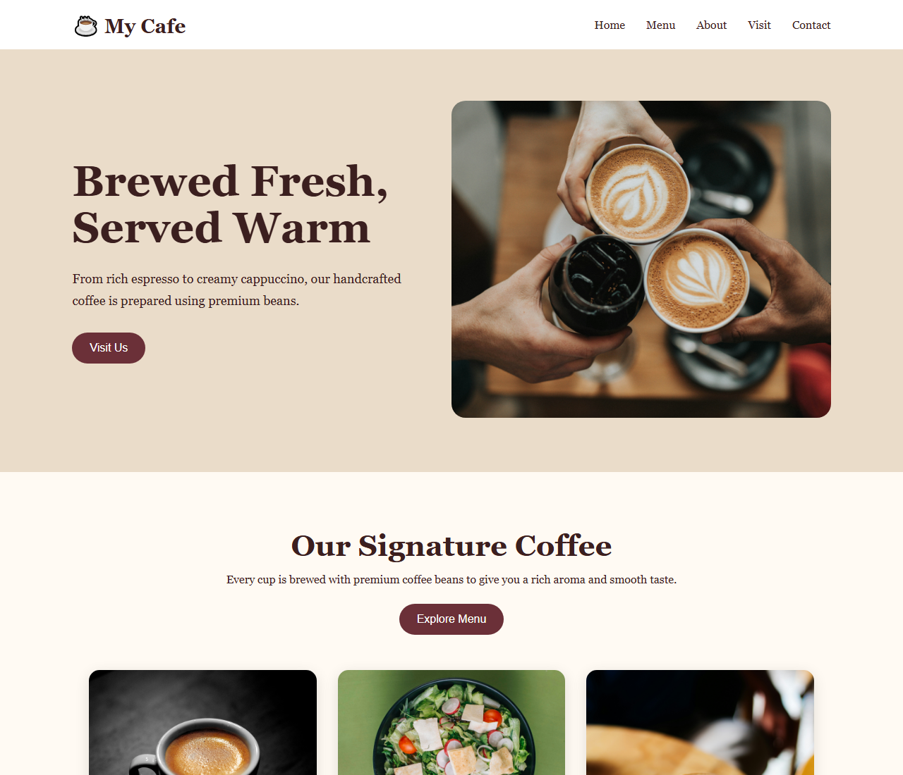

# ☕ My Cafe

A simple, responsive coffee shop website built with **HTML, CSS, and JavaScript**. It showcases the cafe's hero section, signature coffee menu, about/visit sections, and contact details — with interactive buttons and smooth-scrolling navigation.

## 📸 Screenshot



## ✨ Features

- **Sticky navigation bar** with links to Home, Menu, About, Visit, and Contact
- **Hero section** with a tagline and coffee image
- **Signature coffee menu** — Espresso, Latte, Cappuccino cards with photos
- **Interactive buttons** using JavaScript alerts:
  - `Visit Us` / `Get Directions` — welcome message
  - `Explore Menu` — pops up the full menu with prices
- **Contact section** with email and phone
- **Fully responsive** layout (desktop → mobile) via `@media` queries
- Warm, coffee-themed color palette and hover micro-interactions

## 📁 Project Structure

```
cafe/
│
├── index.html          # Main cafe website page (uses style2.css)
├── style2.css          # Stylesheet for the main page
├── script.js           # JavaScript interactions & utilities
├── screenshot.png      # Screenshot of the site (used in this README)
│
└── cafee/              # Alternate/older version of the site
    ├── cafe.html       # Alternate page (includes menu prices & contact form)
    └── style1.css      # Stylesheet for the alternate page
```

## 🚀 Getting Started

This is a pure static website — no build tools or dependencies required.

1. **Clone or download** the project.
2. **Open `index.html`** in any modern web browser.

> Tip: use a local server for the best experience, e.g.
> ```bash
> # with Python
> python -m http.server 8000
> # then visit http://localhost:8000
> ```

## 🧩 JavaScript Functions

Defined in `script.js`:

| Function | Description |
| --- | --- |
| `visitCafe()` | Shows a welcome alert when visiting the cafe |
| `showMenu()` | Displays the full menu with prices in an alert |
| `welcomeMessage()` | Logs a welcome message to the console (runs on load) |
| `orderCoffee(coffee)` | Confirms a coffee order |
| `contactCafe()` | Shows contact details in an alert |
| `changeBackground()` | Switches the page background |
| `darkMode()` / `lightMode()` | Toggles dark / light theme |
| `goToMenu()` / `goToContact()` | Smooth-scrolls to the Menu / Contact sections |

## 🛠️ Customization

- **Menu items & prices** — edit the cards in the HTML and the price list in `showMenu()` in `script.js`.
- **Colors & fonts** — adjust the CSS variables and rules in `style2.css` (or `cafee/style1.css` for the alternate page).
- **Contact info** — update the email/phone in the `#contact` section of `index.html`.

## 🧰 Technologies Used

- HTML5
- CSS3 (Flexbox, media queries)
- Vanilla JavaScript
- Unsplash images (hotlinked)

## 🔗 Repository

- GitHub: https://github.com/Luckysaini01/caffee.git

## 📄 License

This project is for learning/demonstration purposes. All rights reserved.
